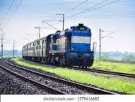

# 🚆 Railway Pass Booking — HTML Demo Project

Welcome to **Railway Pass Booking**, a simple web-based front-end concept designed to simulate the experience of booking a railway pass. Built entirely with pure HTML and creative flair, this project captures the vibe of an IRCTC-style interface without any backend processing.

> 🎨 Designed by [Deepak](https://github.com/Deepakps2004) — for the love of Indian railways, clean UI, and learning by building.

---

## ✨ Features

- Static web pages for pass **registration** and **booking**
- Clean and scrollable UI inspired by real-world IRCTC portals
- Responsive design elements (HTML only)
- Custom imagery to create an immersive booking feel
- Educational purpose: Great starting point for HTML beginners

---

## 📷 Screenshots

| `register.html` | `book.html` |
|------------------|-------------|
|  |  |

> Images like `budha.jpeg`, `trctc.jpg`, and `budget.jpeg` are included for UI richness.

---

## 🧱 Project Structure

```bash
Railwaypass_booking/
├── index.html         # Landing page (if added)
├── register.html      # New pass registration form
├── book.html          # Railway pass booking form
├── irctc.jpeg         # Main background UI image
├── budha.jpeg         # Decorative image
├── trctc.jpg          # Supporting image
├── download.jpeg      # Screenshot-style preview
├── budget.jpeg        # Thematic image (for context)
```

---

## 🚫 Limitations

This is a **static project** — no backend logic, form validation, or database integration. It’s ideal for UI prototyping or HTML practice, but not meant for production use.

---

## 🎯 Future Improvements (optional)

Thinking of levelling this up?

- Add CSS styling with Bootstrap or Tailwind  
- Connect it to a Node.js backend using Express  
- Implement basic validation with JavaScript  
- Store registration data in MongoDB or Firebase  

---

## 📚 Use Case

This project was created for **educational purposes**, specifically to demonstrate:

- Static page design
- Basic form structure in HTML
- Multi-page navigation

It can be used for beginner portfolios, college assignments, or UI/UX concept showcases.

---

## 🌟 Support & Collaboration

If this helped you or inspired you, consider giving it a ⭐ on GitHub or connecting with me [@Deepakps2004](https://github.com/Deepakps2004). I’m always down to build cool stuff, collab, or just talk tech 🚀

---

## 🙏 Disclaimer

This project is not affiliated with Indian Railways or IRCTC. It’s a personal demo made for learning and frontend experimentation.

---

Stay curious. Stay building.  
**– Deepak 🚂❤️**
